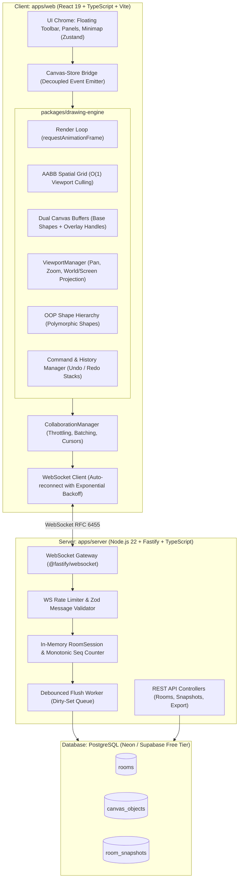

# FLAM Collaborative Canvas

> A high-performance, real-time collaborative infinite canvas built from scratch with TypeScript, native HTML5 Canvas 2D, WebSockets, and Fastify. Built specifically for the **FLAM AI SDE / Frontend R&D hiring assignment**.

[](https://github.com/flam-canvas/collaborative-canvas/actions)
[](https://www.typescriptlang.org/)
[](https://opensource.org/licenses/MIT)

---

## Architecture Overview



---

## Key Engineering Highlights

- **Native HTML5 Canvas 2D Graphics Engine**: Zero third-party canvas wrappers (no Konva, Fabric.js, or Pixi). Custom vector math, affine transformations, and hit-testing algorithms.
- **Dual-Canvas Layering Architecture**: Base canvas (shapes) and overlay canvas (transient live cursors, selection handles, and drawing preview) decouple high-frequency 120 FPS interactions from scene repaints.
- **Object-Oriented Design (GoF Patterns)**:
  - **Template Method**: `BaseShape.render()` orchestrates affine transforms before invoking `drawGeometry()`.
  - **Command Pattern**: `ICommand` encapsulates operations for multi-level Undo/Redo (`HistoryManager`).
  - **Factory Pattern**: `ShapeFactory` reconstitutes polymorphic shapes from serialized JSON DTOs.
  - **Spatial Partitioning**: Uniform grid (`SpatialGrid`) enables $\mathcal{O}(k)$ viewport frustum culling across 10,000+ objects.
- **Real-Time Collaboration**:
  - RFC 6455 WebSockets with monotonic sequence ordering (`seq`).
  - Field-level Last-Write-Wins (LWW) conflict reconciliation.
  - 30ms throttled cursor movement (33 Hz) and Ramer-Douglas-Peucker (RDP) stroke simplification.
- **Resilient Backend & Persistence**:
  - Fastify server with Zod runtime validation and token-bucket rate limiting.
  - In-memory authoritative room state with debounced PostgreSQL persistence worker.
  - Repository Pattern supporting zero-config in-memory local dev and production PostgreSQL via Prisma.
- **Production UI/UX**:
  - Slate & Zinc modern SaaS design system with CSS custom property tokens.
  - Keyboard shortcuts modal, contextual property inspector, interactive minimap, export to PNG/SVG/JSON.

---

## Monorepo Structure

```
FLAM-Collaborative-Canvas/
├── apps/
│   ├── web/                     # React 19 + Vite Frontend SPA
│   └── server/                  # Fastify WebSocket & REST Backend
├── packages/
│   ├── drawing-engine/          # Pure TypeScript OOP Canvas 2D Engine (0 React deps)
│   └── shared/                  # Shared Types, DTOs & Zod Schemas
├── docs/                        # In-Depth Engineering Documentation
│   ├── ARCHITECTURE.md          # System Architecture Deep Dive
│   ├── WEBSOCKET.md             # WebSocket Protocol & Framing Specification
│   ├── DATABASE.md              # Database Schema & Debounced Queue
│   ├── PERFORMANCE.md           # Benchmarks, Metrics & Optimizations
│   ├── SECURITY.md              # Threat Modeling, Rate Limiting & Sanitization
│   ├── DEPLOYMENT.md            # Free-Tier Cloud Deployment Guide
│   ├── DECISIONS.md             # Architectural Decision Records (ADRs)
│   └── INTERVIEW.md             # Technical Interview Q&A Guide
├── .github/workflows/ci.yml     # Automated GitHub Actions CI Pipeline
└── package.json                 # npm Workspaces Monorepo Root
```

---

## Quickstart (Local Development)

### Prerequisites
- Node.js $\ge$ 20 (Node 22 LTS recommended)
- npm $\ge$ 10

### 1. Clone & Install
```powershell
git clone https://github.com/your-username/flam-collaborative-canvas.git
cd flam-collaborative-canvas
npm install
```

### 2. Run Both Frontend and Backend Concurrently
```powershell
npm run dev
```
Or start them individually:
```powershell
# Terminal 1: Backend Server (Port 4000)
npm run dev:server

# Terminal 2: Web Client (Port 5173)
npm run dev:web
```

### 3. Open in Browser
Visit `http://localhost:5173/` in your browser.
Open a second browser window (or incognito tab) to experience **real-time collaborative drawing and live peer cursors**!

---

## Testing & Verification

Run the comprehensive Vitest unit test suite covering vector math, spatial grid culling, shape hit-testing, and command history:
```powershell
npm run test
```

Run strict TypeScript typechecking across all monorepo packages:
```powershell
npm run typecheck
```

Build all packages for production:
```powershell
npm run build
```

---

## Keyboard Shortcuts

| Shortcut | Action |
| :--- | :--- |
| **`V`** | Select & Move tool |
| **`H`** | Hand (Pan canvas) |
| **`R`** | Rectangle tool |
| **`O`** | Circle / Ellipse tool |
| **`L`** | Line tool |
| **`A`** | Arrow tool |
| **`P`** | Pencil (Smooth Freehand) |
| **`T`** | Text tool |
| **`Ctrl + Z`** | Undo |
| **`Ctrl + Y`** | Redo |
| **`Delete / Backspace`** | Delete selected shapes |
| **`Space + Drag`** | Pan viewport |
| **`Ctrl + Wheel`** | Zoom anchored at cursor |
| **`?`** | Open Shortcuts cheat sheet |

---

## Documentation Suite

- 📖 [**Architecture Guide**](docs/ARCHITECTURE.md)
- ⚡ [**WebSocket Protocol**](docs/WEBSOCKET.md)
- 🗄️ [**Database & Persistence**](docs/DATABASE.md)
- 🚀 [**Performance & Benchmarks**](docs/PERFORMANCE.md)
- 🔒 [**Security & Threat Modeling**](docs/SECURITY.md)
- ☁️ [**Deployment Guide**](docs/DEPLOYMENT.md)
- 🧠 [**Architectural Decisions (ADRs)**](docs/DECISIONS.md)
- 🎯 [**Interview Q&A Guide**](docs/INTERVIEW.md)

---

## License
MIT License. Created for the FLAM AI Frontend R&D / SDE Hiring Assignment.
