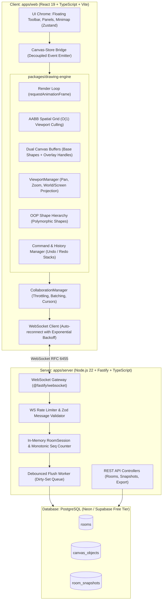

# System Architecture & Technical Design

## 1. High-Level Architecture Overview

The **FLAM Collaborative Canvas** is an enterprise-grade, real-time infinite collaborative whiteboard built from the ground up without third-party canvas abstraction libraries.

---

## 2. Core Architectural Principles

### 2.1 The Dual-Canvas Layering Model
Most naive canvas drawing implementations redraw all shapes whenever a mouse pointer moves or a selection handle is hovered. When canvases contain thousands of objects, this drops framerates to single digits.

Our architecture isolates the canvas into two discrete DOM `<canvas>` buffers:
1. **Base Layer (`canvas-base`)**:
   - Renders all persistent shapes, paths, lines, and text.
   - Redrawn **only** on viewport transformation (camera pan/zoom) or shape mutations.
   - Employs **AABB Spatial Viewport Culling** (`SpatialGrid.query(frustum)`) to rasterize only shapes currently within the camera frustum.
2. **Overlay Layer (`canvas-overlay`)**:
   - Completely transparent, absolutely positioned directly above the base canvas.
   - Renders high-frequency transient UI: peer live cursors, active drawing preview vectors, selection marquee box, resize/rotation handles, and snap-alignment guidelines.
   - Updates at 60–120 FPS with zero re-rasterization cost on the underlying background shapes.

### 2.2 Decoupled State Pipeline
- The high-frequency animation and interaction loops in `packages/drawing-engine` run independently of React's Virtual DOM.
- React components subscribe to canvas events via an outside-React Zustand store bridge (`useStore.getState()`), completely preventing React re-render cascades during mouse drag and freehand draw operations.

---

## 3. Coordinate Systems & Math Transform Pipeline

The canvas engine maintains strict separation between **Screen Space** (physical DOM pixels) and **World Space** (infinite virtual Cartesian plane):

### Screen to World Projection
$$x_w = \frac{x_s - \text{pan}_x}{\text{zoom}}, \quad y_w = \frac{y_s - \text{pan}_y}{\text{zoom}}$$

### World to Screen Projection
$$x_s = x_w \cdot \text{zoom} + \text{pan}_x, \quad y_s = y_w \cdot \text{zoom} + \text{pan}_y$$

### High-DPI / Retina Crispness
The physical canvas dimensions are scaled by `window.devicePixelRatio`:
$$\text{canvas.width} = \text{clientWidth} \times \text{dpr}, \quad \text{canvas.height} = \text{clientHeight} \times \text{dpr}$$
$$\text{ctx.setTransform}(\text{zoom} \cdot \text{dpr}, 0, 0, \text{zoom} \cdot \text{dpr}, \text{pan}_x \cdot \text{dpr}, \text{pan}_y \cdot \text{dpr})$$
This guarantees razor-sharp stroke and text rasterization on 4K, 5K, and Retina displays without blurring.

---

## 4. Object-Oriented Design (GoF Patterns)

1. **Template Method Pattern (`BaseShape`)**:
   - Common canvas setup (translation to shape center, rotation transform, alpha opacity, stroke styling) is handled in `BaseShape.render()`.
   - Polymorphic subclasses override `protected drawGeometry(ctx: CanvasRenderingContext2D): void`.
2. **Command Pattern (`ICommand`)**:
   - Every mutation is encapsulated as a reversible command (`AddShapeCommand`, `DeleteShapeCommand`, `MoveShapeCommand`, `ResizeShapeCommand`).
   - Powers the multi-level `HistoryManager` with bounded undo/redo stacks and atomic rollback.
3. **Factory Pattern (`ShapeFactory`)**:
   - Instantiates concrete polymorphic `BaseShape` subclasses from serializable `ShapeDTO` packets.
4. **Spatial Partitioning Pattern (`SpatialGrid`)**:
   - In-memory uniform grid divides the world space into $250 \times 250$ unit cells, enabling $\mathcal{O}(k)$ viewport culling queries instead of $\mathcal{O}(N)$ brute-force scans.
5. **Observer Pattern (`EventBus`)**:
   - Decoupled typed event emitter for synchronizing UI state with engine lifecycle events.

---

## 5. Room Management & Client SPA Routing Architecture

The application implements a zero-dependency, history-backed SPA router (`useRouter`):
1. **Landing Page (`/`)**:
   - Serves as the launchpad for creating new boards (with human-readable slugs like `board-falcon-48` or custom names), joining existing rooms via room ID or shared URL, and accessing recently visited boards cached in `localStorage` (`flam_recent_boards`).
   - Discovers and lists server-persisted rooms via `GET /api/rooms`.
2. **Collaborative Board Canvas (`/board/:roomId`)**:
   - Directly mounts the collaborative canvas for the target room.
   - Automatically synchronizes URL changes without reloading the page.
   - The `CanvasEngine` instance is completely decoupled from React lifecycle renders via mutable callback refs (`callbacksRef`), preventing engine teardown during store updates or route state reconciliation.
