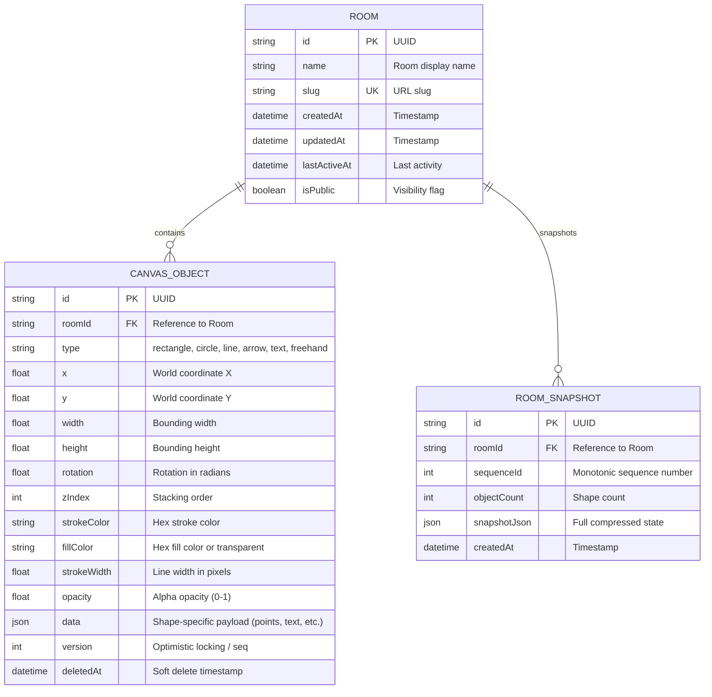

# Database Design & Persistence Architecture

## 1. Relational Schema Design (PostgreSQL + Prisma)

The persistence layer uses PostgreSQL (with support for Neon / Supabase serverless databases) orchestrated via **Prisma ORM**.

---

## 2. Indexing Strategy

1. **`rooms.slug` (UNIQUE INDEX)**:
   - Enables $\mathcal{O}(1)$ index lookups for room URL routing (`/api/rooms/:slug`).
2. **`canvas_objects(roomId, deletedAt)` (COMPOSITE INDEX)**:
   - Dramatically accelerates room state reconstruction by scanning only non-deleted shapes (`WHERE roomId = ? AND deletedAt IS NULL`).
3. **`room_snapshots(roomId, createdAt DESC)` (COMPOSITE INDEX)**:
   - Provides instant retrieval of the most recent room snapshot for sub-50ms cold room joins.

---

## 3. Debounced Persistence Queue (`PersistenceQueue`)

### The Problem
During intense real-time collaboration sessions (e.g. 5 users drawing simultaneously), the server can receive hundreds of mutation messages per second. Writing each event directly to PostgreSQL would saturate the database connection pool and cause severe I/O thrashing.

### The Solution
The system uses an in-memory **write-back buffer**:
1. Incoming mutations are applied immediately to the authoritative in-memory `RoomSession`.
2. Changed shape IDs are added to a dirty-set (`dirtyShapes` and `dirtyDeletes`).
3. A background timer flushes the dirty buffer to PostgreSQL every **2,500 ms** (`PERSISTENCE_FLUSH_INTERVAL_MS`).
4. When all users leave a room or the server receives a `SIGTERM` / `SIGINT` signal, an immediate graceful flush occurs.

---

## 4. Repository Pattern (SOLID Principles)

To ensure the codebase runs seamlessly in all environments, the data access layer implements the **Repository Pattern**:
- `IRoomRepository`: Core interface defining shape and room persistence contracts.
- `InMemoryRoomRepository`: Provides instant, zero-config local development without needing Docker or an external database.
- `PrismaRoomRepository`: Production implementation connecting to Neon Serverless PostgreSQL.
- Switching between them is handled dynamically in `apps/server/src/db/index.ts` based on the presence of `DATABASE_URL`.
